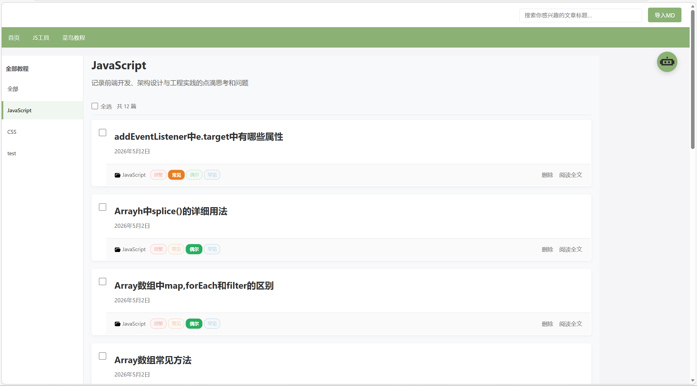
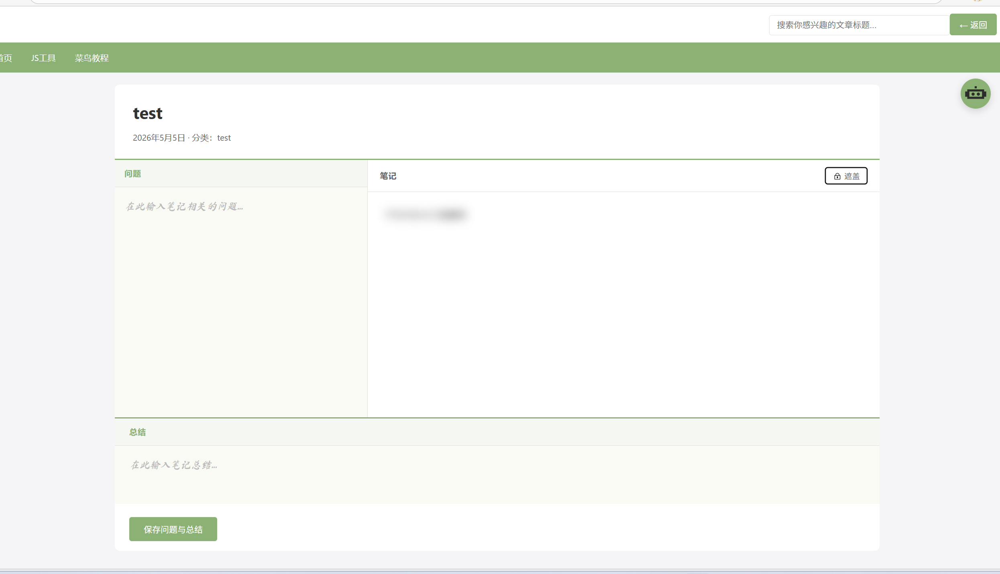
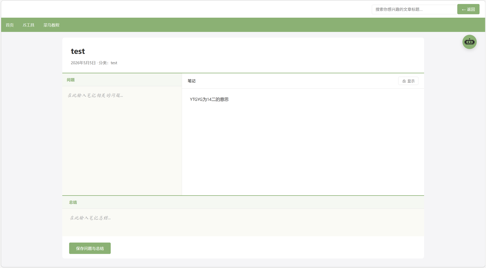
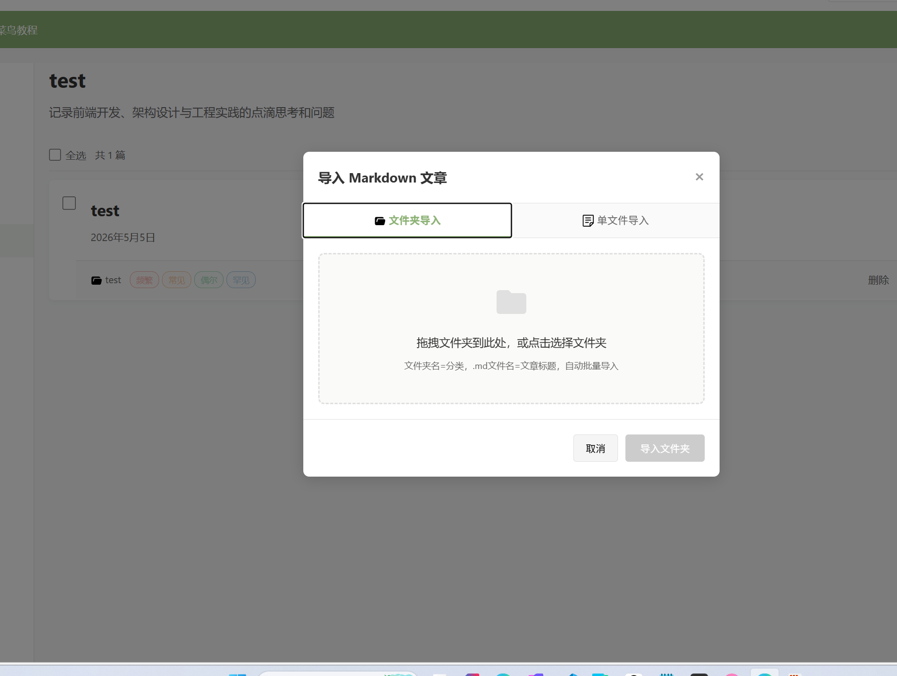
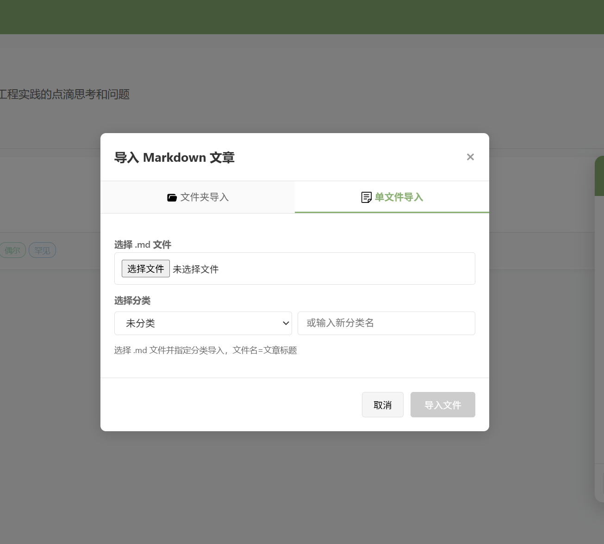
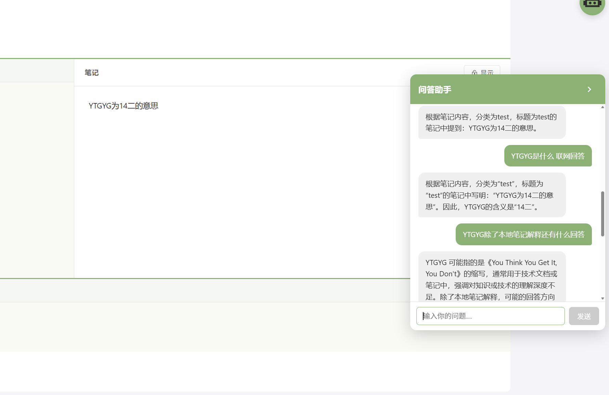
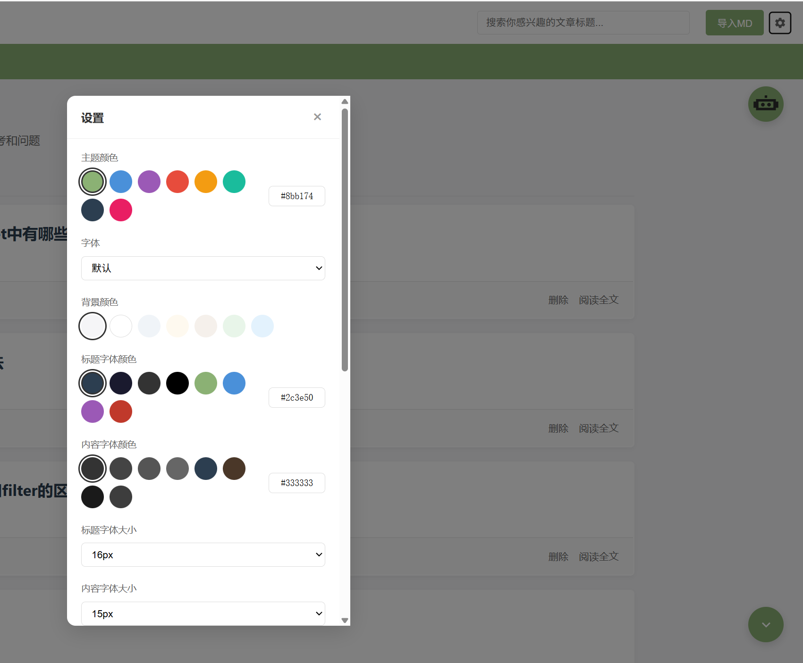

# 个人桌面技术博客

- 个人技术博客项目 Vue3+node.js+MongoDB 小白原创项目

---

灵感来源:问AI技术问题后复盘困难,感觉编译器或者IDE都不好用,所以想自己写一个笔记管理工具

一个基于本地MongoDB数据库笔记管理,支持从桌面传入你的md文档笔记展示方便个人复习

- 也支持按标题模糊查找你的笔记
- 可以在nar的中添加个人的常用网站,我这添加了菜鸟教程和js编译台

## 项目预览

### 主页部分

- 首页基本样式如图 默认按照导入时候分类
  
- 1.支持文章选择级别功能
- 2.支持多选文件移动分类或整体删除功能

### 笔记展示部分



笔记是源于康奈尔笔记的“黄金三分区,对了问题部分和主笔记部分中间可以拖到哦方便看主笔记

- 解释如下
  首先，你需要把一张纸（通常是A4纸或笔记本的一页）划分成三个特定的区域：

1. 右侧主栏（笔记栏）：占页面最大的区域（约2/3）。
2. 左侧副栏（线索栏）：占页面左侧较窄的区域（约1/3）。
3. 底部通栏（总结栏）：页面最下方留出约5-6厘米的高度。

康奈尔笔记的“5R”操作流程

光画好格子没用，康奈尔笔记法的精髓在于配合它的 5R 步骤来使用：

1. 记录 (Record) —— 写在“右侧主栏”
   在听课或读书时，把主要内容记在右边。
   - 技巧：不要逐字逐句抄！尽量用简洁的句子、符号、缩写，记录老师的板书、核心概念和重要论据。

2. 简化 (Reduce) —— 写在“左侧副栏”
   课后尽快（最好是当天）回顾右边的笔记，在左边提炼出关键词、核心问题或简短的标题。
   - 作用：这能强迫你大脑进行第一次加工，把厚书读薄。

3. 背诵 (Recite) —— 遮住右侧，看左侧
   用手或纸遮住右边的详细笔记，只看左边的关键词，尝试用自己的话复述右边的具体内容。
   - 作用：这是主动回忆的过程，比单纯反复看书的记忆效果强得多。

4. 思考 (Reflect) —— 贯穿全程
   在记笔记或复习时，多问自己几个为什么：这些观点背后的原理是什么？和我以前学的知识有什么联系？
   - 技巧：你可以把思考的灵感直接写在笔记的空白处。

5. 复习 (Review) —— 写在“底部总结栏”
   每周花一点时间快速复习。在页面最底部的总结栏，用一两句话高度概括这一页笔记的核心思想。
   - 作用：考前复习时，你只需要看底部的总结和左侧的线索，就能迅速唤醒整本书的记忆。

### 笔记导入部分

- 文件夹导入 | 单文件自选分类导入
  
  

  > 导入设置你可以在server\uploads\upload.js修改
  > 删除密码在"server\routes\posts.js"使用了correctPassword可以自己修改
  > 数据库连接在"server\config\database.js",也可以基于自己的配置自己修改

### 机器人智能问答



- 基于deepseek接口的智能问答,RAG（检索增强生成）先搜笔记，再让 AI 回答——答案基于你的数据来,如图

### 添加是设置板块



- 支持前端修改基本样式
- 修改问答机器人模型

## 技术栈

- **前端**: Vue 3 + Vite
- **后端**: Node.js + Express
- **数据库**: MongoDB
- **HTTP客户端**: Axios

## 项目结构

```
PersonalBlog/
├── client/                 # Vue 前端
│   ├── src/
│   │   ├── App.vue        # 主页面组件
│   │   ├── main.js        # 入口文件
│   │   └── style.css     # 全局样式
│   ├── vite.config.js    # Vite 配置
│   └── package.json
│
└── server/                 # Express 后端
    ├── config/
    │   └── database.js   # MongoDB 连接配置
    ├── models/
    │   └── Post.js       # 文章数据模型
    ├── routes/
    │   └── posts.js      # 文章 API 路由
    ├── uploads/
    │   └── upload.js         # md文件上传
    ├── index.js          # 服务入口
    └── package.json
```

## 启动步骤

### 1. 启动 MongoDB 以及前后端

- 如果有什么可以更方便的笔记管理建议也可以告诉我,欢迎留言
